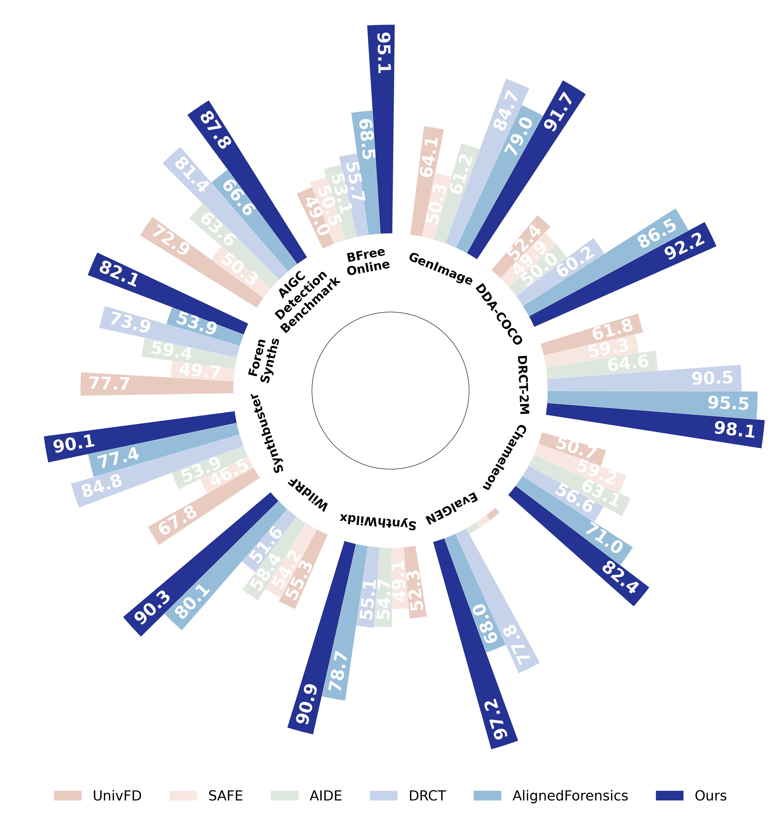

# Polar Grouped Bar Plot

A script to draw a **polar grouped bar chart** (visually similar to a radar chart),
which is useful for comparing multiple methods across multiple benchmarks / datasets.

---

## 1. Dependencies

- Python >= 3.8
- matplotlib
- numpy

---

## 2. Quick Start

```bash
python plot.py
```

This will generate an image in the current directory

<div style="text-align:center; margin:20px 0;">
    
</div>

---

## 3. Code Overview

- `plot_polar_grouped_bars(...)`: core plotting function (can be imported and reused)
- `DEFAULT_METHODS / DEFAULT_METRICS / DEFAULT_SCORES`: built-in example data
- `DEFAULT_SHUFFLE`: optional reordering for better readability

---

## 4. How to Use Your Own Data

Modify these three variables in `plot.py`:

- `DEFAULT_METHODS`: list of method names (length = **M**)
- `DEFAULT_METRICS`: list of benchmark names (length = **N**)
- `DEFAULT_SCORES`: 2D array with shape **M x N**

Example:

```python
DEFAULT_METHODS = ["A", "B", "C"]
DEFAULT_METRICS = ["D1", "D2", "D3"]
DEFAULT_SCORES = [
    [10, 20, 30],  # A
    [15, 25, 35],  # B
    [12, 22, 32],  # C
]
```

---

## 5. FAQ

### Q1: Why is there a hollow center?
The inner hole makes the chart look like a donut-shaped radar plot and avoids clutter around the origin.

### Q2: Why do methods still have bars when `score <= offset`?
To keep every method visible for every metric. The minimum bar height is controlled by `--min-h`.

---

