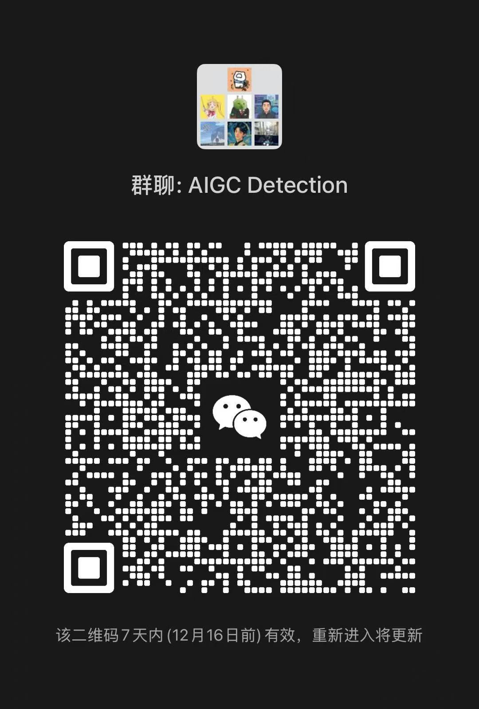

<div align="center">
<h1> Dual Data Alignment [NeurIPS'25 Spotlight]</h1>
<h3>Dual Data Alignment Makes AI-Generated Image Detector Easier Generalizable</h3>

Ruoxin Chen<sup>1</sup>, Junwei Xi<sup>2</sup>, Zhiyuan Yan<sup>3</sup>, Keyue Zhang<sup>1</sup>, Shuang Wu<sup>1</sup>,  
Jingyi Xie<sup>4</sup>, Xu Chen<sup>2</sup>, Lei Xu<sup>5</sup>, Isabel Guan<sup>6†</sup>, Taiping Yao<sup>1†</sup>, Shouhong Ding<sup>1</sup>


<sup>1</sup>Tencent YouTu Lab
<sup>2</sup>East China University of Science and Technology
<sup>3</sup>Peking University

<sup>4</sup>Renmin University of China
<sup>5</sup>Shenzhen University
<sup>6</sup>Hong Kong University of Science and Technology


<!-- [[GitHub](https://github.com/roy-ch/Dual-Data-Alignment)] [[Paper](https://arxiv.org/abs/2505.14359)] [[Dataset (Coming Soon)]()] -->
[](https://github.com/roy-ch/Dual-Data-Alignment)
[](https://arxiv.org/abs/2505.14359)
</div>

## 📣 News

- `2025/09` : 🎉 Accepted by NeurIPS 2025 as **Spotlight**.
- `2026/02` : Official checkpoint released. We apologize for the previously uploaded checkpoint, whose performance slightly differed from the results reported in the paper.
<!-- - `2025/08` : 🏆 DDA (Ke-Yue Zhang's team) wins **1st Prize** at the [The 6th Face Anti-Spoofing Workshop: Unified Physical-Digital Attacks Detection@ICCV2025]((https://sites.google.com/view/face-anti-spoofing-challenge/winners-results/challengeiccv2025)) ! Notably, 🔥 our winner model is exclusively trained on DDA-aligned COCO, without using any competition-provided face data. **A model trained with no face data wins a face anti-spoofing competition**.-->
<!-- - - `2025/10` : 🏆 **[ICCV 2025 FAS Challenge: 1st Prize](https://sites.google.com/view/face-anti-spoofing-challenge/winners-results/challengeiccv2025) (Ke-Yue Zhang’s team)**-->

---

<!-- 两图一行：bias 左边，benchmark 右边 -->
<!-- <div style="display:flex; justify-content:space-between; align-items:center; margin:20px 0;">
    
    
</div> -->

## 🤖 Motivation
<div style="text-align:center; margin:20px 0;">
    
</div>

---
## 📊 Evaluation on 11 benchmarks
JPEG compression with a quality factor of 96 is applied to the synthetic images in GenImage, ForenSynths, and AIGCDetectionBenchmark to mitigate format bias. The number of generators used in each dataset is reported: G refers to GAN, D to Diffusion, and AR to Auto-Regressive models. Among the 11 benchmarks, Chameleon, Synthwildx, WildRF, and Bfree-Online are the 4 in-the-wild datasets. Notably, DDA is **the first detector** to achieve over 80% cross-data accuracy on Chameleon.

| Benchmark | NPR (CVPR'24) | UnivFD (CVPR'23) | FatFormer (CVPR'24) | SAFE (KDD'25) | C2P-CLIP (AAAI'25) | AIDE (ICLR'25) | DRCT (ICML'24) | AlignedForensics (ICLR'25) | DDA (ours) |
| --- | --- | --- | --- | --- | --- | --- | --- | --- | --- |
| GenImage (1G + 7D) | 51.5 ± 6.3 | 64.1 ± 10.8 | 62.8 ± 10.4 | 50.3 ± 1.2 | 74.4 ± 8.4 | 61.2 ± 11.9 | 84.7 ± 2.7 | 79.0 ± 22.7 | **91.7 ± 7.8** |
| DRCT-2M (16D) | 37.3 ± 15.0 | 61.8 ± 8.9 | 52.2 ± 5.7 | 59.3 ± 19.2 | 59.2 ± 9.9 | 64.6 ± 11.8 | 90.5 ± 7.4 | 95.5 ± 6.1 | **98.1 ± 1.4** |
| DDA-COCO (5D) | 42.2 ± 5.4 | 52.4 ± 1.5 | 51.7 ± 1.5 | 49.9 ± 0.3 | 51.3 ± 0.6 | 50.0 ± 0.4 | 60.2 ± 4.3 | 86.5 ± 19.1 | **92.2 ± 10.6** |
| EvalGEN (3D + 2AR) | 2.9 ± 2.7 | 15.4 ± 14.2 | 45.6 ± 33.1 | 1.1 ± 0.6 | 38.9 ± 31.2 | 19.1 ± 11.1 | 77.8 ± 5.4 | 68.0 ± 20.7 | **97.2 ± 4.2** |
| Synthbuster (9D) | 50.0 ± 2.6 | 67.8 ± 14.4 | 56.1 ± 10.7 | 46.5 ± 20.8 | 68.5 ± 11.4 | 53.9 ± 18.6 | 84.8 ± 3.6 | 77.4 ± 25.0 | **90.1 ± 5.6** |
| ForenSynths (11G) | 47.9 ± 22.6 | 77.7 ± 16.1 | 90.0 ± 11.8 | 49.7 ± 2.7 | **92.0 ± 10.1** | 59.4 ± 24.6 | 73.9 ± 13.4 | 53.9 ± 7.1 | 81.4 ± 13.9 |
| AIGCDetectionBenchmark (7G + 10D) | 53.1 ± 12.2 | 72.5 ± 17.3 | 85.0 ± 14.9 | 50.3 ± 1.1 | 81.4 ± 15.6 | 63.6 ± 13.9 | 81.4 ± 12.2 | 66.6 ± 21.6 | **87.8 ± 12.6** |
| Chameleon (Unknown) | 59.9 | 50.7 | 51.2 | 59.2 | 51.1 | 63.1 | 56.6 | 71.0 | **82.4** |
| Synthwildx (3D) | 49.8 ± 10.0 | 52.3 ± 11.3 | 52.1 ± 8.2 | 49.1 ± 0.7 | 57.1 ± 4.2 | 48.8 ± 0.8 | 55.1 ± 1.8 | 78.8 ± 17.8 | **90.9 ± 3.1** |
| WildRF (Unknown) | 63.5 ± 13.6 | 55.3 ± 5.7 | 58.9 ± 8.0 | 57.2 ± 18.5 | 59.6 ± 7.7 | 58.4 ± 12.9 | 50.6 ± 3.5 | 80.1 ± 10.3 | **90.3 ± 3.5** |
| Bfree-Online (Unknown) | 49.5 | 49.0 | 50.0 | 50.5 | 50.0 | 53.1 | 55.7 | 68.5 | **95.1** |
| **Avg ACC** | 46.1 ± 16.1 | 56.3 ± 16.5 | 59.6 ± 14.6 | 47.6 ± 16.0 | 62.1 ± 15.6 | 54.1 ± 12.8 | 70.1 ± 14.6 | 75.0 ± 11.1 | **90.7 ± 5.3** |
| **Min ACC** | 2.9 | 15.4 | 45.6 | 1.1 | 38.9 | 19.1 | 50.6 | 53.9 | **81.4** |

---

## 📊 Evaluation Benchmarks

All evaluation benchmarks used in our experiments are obtained from publicly available sources.  
We sincerely thank the original authors for providing these valuable AIGI detection datasets.

| Benchmark | Paper | Download |
|---|---|---|
| GenImage | GenImage: A Million-Scale Benchmark for Detecting AI-Generated Image | [Google Drive](https://drive.google.com/drive/folders/1jGt10bwTbhEZuGXLyvrCuxOI0cBqQ1FS) |
| DRCT-2M | DRCT: Diffusion Reconstruction Contrastive Training towards Universe Detection of Diffusion Generated Images | [ModelScope](https://modelscope.cn/datasets/BokingChen/DRCT-2M/files) |
| Synthbuster | Synthbuster: Towards Detection of Diffusion Model Generated Images | [Official Page](https://www.veraai.eu/posts/dataset-synthbuster-towards-detection-of-diffusion-model-generated-images) |
| ForenSynths | CNN-generated images are surprisingly easy to spot... for now | [Google Drive](https://drive.google.com/drive/u/0/folders/14E_R19lqIE9JgotGz09fLPQ4NVqlYbVc) · [CMU Box](https://cmu.app.box.com/s/4syr4womrggfin0tsfhxohaec5dh6n48) |
| AIGCDetectionBenchmark | A Comprehensive Benchmark for AI-generated Image Detection | [ModelScope](https://modelscope.cn/datasets/aemilia/AIGCDetectionBenchmark/files) |
| Chameleon | A Sanity Check for AI-generated Image Detection | Contact: [tattoo.ysl@gmail.com](mailto:tattoo.ysl@gmail.com) |
| SynthwildX | Raising the Bar of AI-generated Image Detection with CLIP | [GitHub](https://github.com/grip-unina/ClipBased-SyntheticImageDetection/tree/main/data/synthwildx) |
| WildRF | Real-Time Deepfake Detection in the Real-World | [Google Drive](https://drive.google.com/file/d/1A0xoL44Yg68ixd-FuIJn2VC4vdZ6M2gn/view) |
| Bfree-Online | A Bias-Free Training Paradigm for More General AI-generated Image Detection | [Official Download](https://www.grip.unina.it/download/prog/B-Free/training_data/) |
| DDA-COCO | Dual Data Alignment Makes AI-Generated Image Detector Easier Generalizable | [ModelScope](https://www.modelscope.cn/datasets/JunweiXi/DDA-Training-Set) |
| EvalGEN | Dual Data Alignment Makes AI-Generated Image Detector Easier Generalizable | [HuggingFace](https://huggingface.co/datasets/Junwei-Xi/EvalGEN) |


---

## 📦 Training data

The training dataset has been released on [ModelScope](https://www.modelscope.cn/datasets/JunweiXi/DDA-Training-Set) and [HuggingFace](https://huggingface.co/datasets/Junwei-Xi/DDA-Training-Set).

---

## 📑 Checkpoints

* **Old ModelScope (legacy)**: [ModelScope](https://www.modelscope.cn/models/JunweiXi/Dual-Data-Alignment/files) *(deprecated / kept for reference)*
* **New release**: [ModelScope](https://huggingface.co/Junwei-Xi/Dual-Data-Alignment)

---

## ⭐ New Challenging Benchmarks

DDA-COCO Benchmark has been released on [ModelScope](https://www.modelscope.cn/datasets/JunweiXi/DDA-COCO) and [HuggingFace](https://huggingface.co/datasets/Junwei-Xi/DDA-COCO).

EvalGEN Benchmark has been released on [ModelScope](https://www.modelscope.cn/datasets/JunweiXi/EvalGEN) and [HuggingFace](https://huggingface.co/datasets/Junwei-Xi/EvalGEN).

---

## 🎯 ToDo List <a name="todo"></a>

- [x] Release arxiv paper with complete BibTeX citation
- [x] Release checkpoint and inference code
- [x] Release training set and training script
- [x] Release code for DDA data construction


## 📨 Contact

If you have any questions or suggestions, please feel free to contact us 
at [cusmochen@tencent.com](cusmochen@tencent.com).

Feel free to reach out if you have any questions. This WeChat group brings together researchers working on AI-generated image detection, including authors of Effort (ICML 2025 Oral), DRCT (ICML 2024 Spotlight), and related work. Our goal is to build a focused community where researchers can exchange ideas and inspire new directions in AIGI detection.
<p align="center">
 
</p>


## 😄 Acknowledgement

Part of this codebase is adapted from [UniversalFakeDetect](https://github.com/WisconsinAIVision/UniversalFakeDetect). Huge thanks to the original authors for sharing their excellent work!


## ✍️ Citing
If you find this repository useful for your work, please consider citing it as follows:
```shell
@inproceedings{chen2025dual,
  title={Dual Data Alignment Makes {AI}-Generated Image Detector Easier Generalizable},
  author={Ruoxin Chen and Junwei Xi and Zhiyuan Yan and Ke-Yue Zhang and Shuang Wu and Jingyi Xie and Xu Chen and Lei Xu and Isabel Guan and Taiping Yao and Shouhong Ding},
  booktitle={The Thirty-ninth Annual Conference on Neural Information Processing Systems},
  year={2025},
  url={https://openreview.net/forum?id=C39ShJwtD5}
}
```
